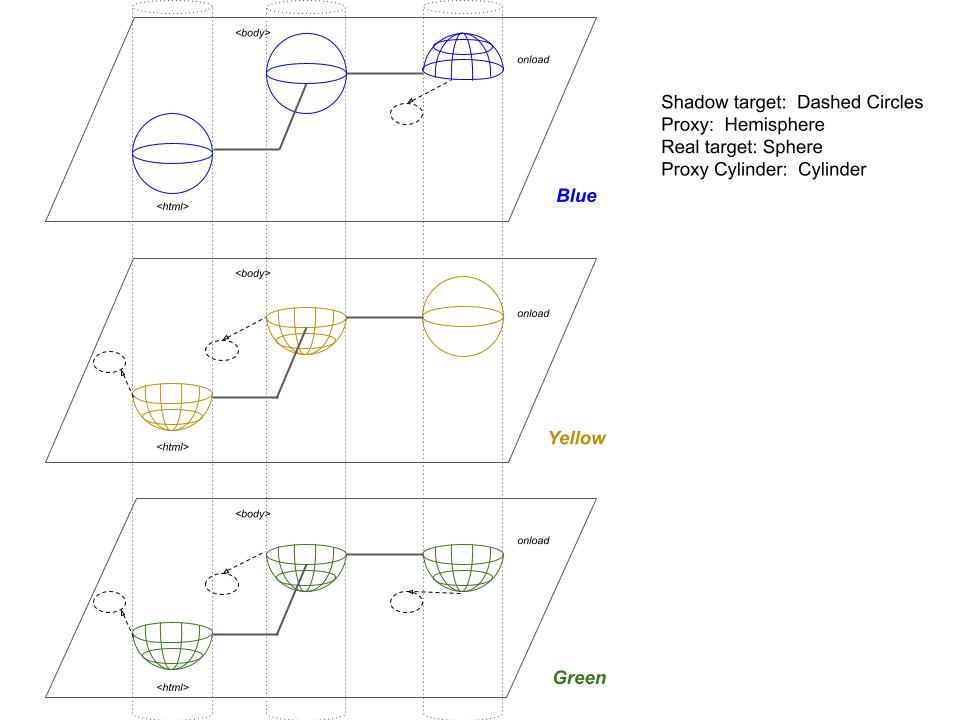

# Mass Proxy Revocation

## Status

- Champion(s): Mark S. Miller, Jack Works (all credit goes to Alex and Bradley)
- Author(s): Alexander J. Vincent
- Author Emeritus: Bradley Farias
- Stage: 0

## Motivation

Membranes, which use Proxy and WeakMap to separate one object graph (think "Realm") from others, could have hundreds or thousands of proxies in each object graph.  In revoking an object graph, a membrane must revoke all of these proxies at once, and all proxies in other object graphs to objects in that object graph.

We propose the creation and tracking of "revocation signal" symbols, which developers can pass instances into `new Proxy()` or  `Proxy.revocable()` via a *third* argument.  Users could create these signals via a `Proxy.createSignal()` static function, and revoke them via a `Proxy.finalizeSignal(signal)` static function.  (We are aware of the Cancellation proposal and are quite willing to replace this mechanism with an API from that proposal.)

In TypeScript [(copied from Microsoft's TypeScript project under the Apache license)](https://github.com/microsoft/TypeScript/blob/89d9af2ab908d00a942073c21c0657a119ddfe66/lib/lib.es2015.proxy.d.ts), this would be:

```typescript
interface ProxyConstructorOptions {
  signal?: symbol;
}

interface ProxyConstructor {
  revocable<
    T extends object
  >(
    target: T,
    handler: ProxyHandler<T>,
    options?: ProxyConstructorOptions
  ): {
    proxy: T;
    revoke: () => void;
  };

  new <
    T extends object
  >(
    target: T,
    handler: ProxyHandler<T>,
    options?: ProxyConstructorOptions
  ): T;

  createSignal() : symbol;

  finalizeSignal(signal: symbol): void;
}

declare var Proxy: ProxyConstructor;
```

Example:

```javascript
const s1 = Proxy.createSignal();

const b1 = new Proxy([], {}, { signal: s1 });
const {proxy: b2, revoke: b2_revoke} = Proxy.revocable({}, {}, { signal: s1 });

Proxy.finalizeSignal(s1); // kills s1, b1, b2.
```

## Use cases

### Membranes revoking entire object graphs

Consider the following where each plane is a Realm, raw objects are spheres, proxies are hemispheres, and the vertical cylinders represent connections between proxies and their objects.  (This is a geometric model of a membrane.)

Figure 1



If we wish to revoke access to the Yellow realm, we can't just revoke proxies in the Yellow realm.  The "onload" proxies in the Blue and Green realms would only find out when they tried to access the Yellow “onload” object and threw exceptions.  They’re dead and don’t know it.  The client code is responsible for handling these exceptions.

```javascript
// This is pseudo-code!
const membrane = new Membrane;

const green = new ShadowRealm;
const yellow = new ShadowRealm;

yellow.car = new Car;

// Setting up the initial reference to yellow.car in the green realm:
membrane.bindProxyForObject(yellow, green, "car");

// In the membrane, this runs:
{
  const yellowGreenSignal = Proxy.createSignal();
  this.#cacheRevokeSignal(yellowGreenSignal, [yellow, green]);

  const shadowTarget = {};
  const proxy = new Proxy(shadowTarget, membraneProxyHandler, { signal: yellowGreenSignal });

  green.car = proxy;

  this.#bindOneToOne(yellow, yellow.car, green, proxy);
}

// In the green realm, this code runs.
green.car.driver = new Driver;

// In the membrane, this runs:
{
  const yellowGreenSignal = this.#getRevokeSignal(yellow, green); // gets yellowGreenSignal from earlier

  const shadowTarget = {};
  const proxy = new Proxy(shadowTarget, membraneProxyHandler, { signal: yellowGreenSignal });
  yellow.car.driver = proxy;

  this.#bindOneToOne(green, green.car.driver, yellow, proxy);
}

membrane.revoke(yellow);

// In the membrane, this runs:
{
  const signals = this.#getRevokingSignals(yellow); // returns [yellowGreenSignal]
  signals.forEach(s => Proxy.finalizeSymbol(s));
  // this triggers yellowGreenSignal, which knocks out green.car and yellow.car.driver
}
```

Note we are not specifying the membrane API here.  The methods for the membrane are only illustrative.

One particular benefit of this is returning revocation management (and thus, garbage collection of proxies) back to the JavaScript engine.  The need to explicitly generate a revoker function becomes obsolete, but for backwards compatibility, we'd preserve it.

### Memory optimizations

If we don't actually create a revoker function per proxy, this means less memory allocation and less garbage collection pressure.

## Description

*Developer-friendly documentation for how to use the feature*

## Comparison

*A comparison across various related programming languages and/or libraries. If this is the first sort of language or library to do this thing, explain why that is the case. If this is a standard library feature, a comparison across the JavaScript ecosystem would be good; if it's a syntax feature, that might not be practical, and comparisons may be limited to other programming languages.*

There is prior art for passing AbortSignals across Realms.  See issue [#1](https://github.com/ajvincent/proposal-mass-proxy-revocation/issues/1).

## Implementations

### Polyfill/transpiler implementations

*A JavaScript implementation of the proposal, ideally packaged in a way that enables easy, realistic experimentation. See [implement.md](https://github.com/tc39/how-we-work/blob/master/implement.md) for details on creating useful prototype implementations.*

### Native implementations

## Q&A

*Frequently asked questions, or questions you think might be asked. Issues on the issue tracker or questions from past reviews can be a good source for these.*

**Q**: Why does this need to be built-in, instead of being implemented in JavaScript?

**A**: (1) We want to hand actual management of the proxies back to the JavaScript engine.  Membranes storing hundreds of revokers and then revoking them synchronously is painful.  (2) We believe this design will work better for compartments.

**Q**: Why have a third argument?

**A**: We believe this is the simplest way to maintain backwards compatibility and add the feature we are requesting.  We are also aware of the importance of shaping this third-argument API correctly up front.

**Q**: What relationship is there to the [Cancellation proposal](https://github.com/tc39/proposal-cancellation) and/or [AbortController](https://developer.mozilla.org/en-US/docs/Web/API/AbortController)? ([#13](https://github.com/ajvincent/proposal-mass-proxy-revocation/issues/13))

**A**: We're certainly willing to adjust our proposal to be compatible with and/or dependent on the Cancellation proposal.  Regarding AbortController, SES believes that making TC39 proposals depend on Web API's is a non-starter, unless AbortController becomes part of ECMAScript (highly unlikely).

In particular, the `Proxy.createSignal()` and `Proxy.finalizeSignal(signal)` methods we can replace with another standard API from TC39.

### Out of Scope

#### Observing revocation

This proposal is tailored towards allowing creation of revocable groupings of Proxies.  A general signaling mechanism has been the subject of debate at TC39 and we believe this proposal serves its own purpose without an observation mechanism. There is no clear reason why signaling could not be added to the proposed APIs here as a follow on. Adding signaling has a variety of concerns such as re-entrancy and compatibility with other host environment features.
